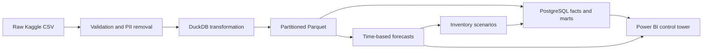

# Retail Supply Chain Control Tower
## Demand Forecasting, Inventory Optimization, and Delivery Performance Analytics

An executable portfolio project for data, BI, supply-chain, operations and junior analytics-engineering interviews. It connects demand planning to inventory trade-offs and delivery/profit visibility while preserving the independence of its sources.

**Delivery status:** Repository, Python pipeline, PostgreSQL schemas/marts, SQL analyses, notebooks, tests, Power BI specifications and interview materials are included. The source Kaggle datasets were not supplied. Included executed results use a deterministic **synthetic fixture**, never real Walmart/DataCo findings. See reports/validation_status.md for exact executed checks. A native `.pbix` has not been created or validated.

## Start here

**Portfolio status: primary project in development.** The synthetic demo is implemented; a complete source-data case study and native Power BI report are still pending.

| Review goal | Where to go |
| --- | --- |
| Understand the problem and design | [Project walkthrough](docs/project_walkthrough.md) · [Architecture](docs/architecture.md) |
| Learn the code and analytical decisions | [Annotated study guide](docs/project-explained.md) · [Searchable HTML guide](docs/project-explained.html) |
| Review recorded execution evidence | [Validation status](reports/validation_status.md) |
| Run the project locally | [Installation](#installation) · [Synthetic demo](#run-the-self-contained-integration-demo) |
| Understand data and analytical caveats | [Data dictionary](docs/data_dictionary.md) · [Methodology](reports/methodology.md) · [Limitations](reports/assumptions_and_limitations.md) |
| Choose the next task | [Next milestones](#next-milestones) |

### Implemented and pending

- **Recorded as executed on synthetic data:** sample pipeline, 19 Python/PostgreSQL tests, 28 SQL analyses, and six notebooks. See the validation report for environment and scope; these are prior recorded checks, not a new run from this documentation update.
- **Pending:** real Kaggle sample/full validation, full-scale runtime measurements, native Power BI/DAX reconciliation and screenshots, and automated CI.
- **Known analytical limitation:** held-out forecast interval coverage is below nominal targets; calibration needs improvement.
- **Demo access:** the runnable demonstration is local and synthetic. There is no verified public hosted demo. This repository and its documentation currently require authorized access.

### Next milestones

1. Reproduce the fixture installation from a clean environment and record exact Python, operating-system and database versions.
2. Obtain the source datasets under their terms, run the real sample without skipping audits, and record metrics with provenance.
3. Build the six-page Power BI report on Windows, reconcile its measures to the exports, and capture screenshots.
4. Benchmark the full dataset and investigate interval calibration before presenting the project as a completed flagship case study.

## Business problem and objectives
A multi-state retailer wants to reduce stockouts and excess stock, anticipate 28-day sales, understand demand variation and inspect delivery and profit leakage. The VP of Supply Chain, inventory planner, logistics manager, store operations manager and finance manager need consistent grains, denominators and uncertainty. This project forecasts item-store demand, derives configurable inventory policies, compares replenishment scenarios and examines independent logistics performance. It does not promise operational savings without deployment evidence.

## Data sources
- [M5 Forecasting Accuracy](https://www.kaggle.com/competitions/m5-forecasting-accuracy/data): sales, weekly price, calendar, events and SNAP. The pipeline prefers sales_train_evaluation.csv and falls back to sales_train_validation.csv.
- [DataCo Smart Supply Chain](https://www.kaggle.com/datasets/alinoranianesfahani/dataco-smart-supply-chain-for-big-data-analysis): independent order-line delivery and profitability data. It is not Walmart data. No row-level cross-domain join exists.

M5 has no verified complete inventory, procurement costs or supplier lead times. All such inputs are explicitly simulated. SNAP is not a verified promotion indicator. Sales are not necessarily uncensored demand. Third-party sources retain their own licenses; the MIT license applies only to project code/documentation.

## Architecture

For portability, the executable pipeline computes from Parquet and loads the serving database transactionally after all result tables exist. See docs/architecture.md for the ER diagram and grains.

## Technology
Python 3.11+; Pandas/NumPy; DuckDB and Parquet; PostgreSQL with SQLAlchemy/psycopg; scikit-learn, LightGBM and Statsmodels; Matplotlib/Plotly; Pytest; Power BI; Git/GitHub. Direct dependencies are pinned in requirements.txt.

## Repository
See docs/repository_tree.txt for the complete tree. The source modules separate ingestion, validation, transformation, forecasting, inventory and operations. SQL files 00–09 create and validate the dimensional serving model; interview_queries.sql contains 28 analytical queries. Six notebooks explore exported outputs. Power BI files contain the model, measure catalogue, theme and six-page design. Reports distinguish actual observations, forecasts and scenario estimates. Docs include architecture, field dictionary, interview answers and resume bullets.

## Detailed project and code explanation

The [annotated study guide](docs/project-explained.md) explains the business questions, analysis choices, assumptions and limitations, then maps explanations to the source line numbers. It covers 69 files, including Python, SQL, configuration, notebook code cells and all 46 DAX measures. Related lines are grouped when they form one calculation or query.

For a searchable version, download [project-explained.html](docs/project-explained.html) and open it in your browser; it works offline without installing anything. GitHub displays HTML source rather than running this page. Both guides document executable source snapshot `0b85891`; later documentation changes do not alter those code references.

## Installation

Clone with an account that has access, then run commands from the repository root:

```bash
git clone https://github.com/abhijith-abhii/retail-supply-chain-control-tower.git
cd retail-supply-chain-control-tower
```

```bash
python3.11 -m venv .venv
source .venv/bin/activate
python -m pip install -r requirements.txt
cp .env.example .env
```
For the notebooks, also run `python -m pip install -r requirements-notebooks.txt` and select this environment as the notebook kernel.

Windows activation: `.venv\Scripts\activate`. LightGBM on macOS requires OpenMP (`brew install libomp` when Homebrew is available). The project validation environment used the OpenMP library bundled with scikit-learn via a local library path; this is recorded in validation_status.md. Do not commit `.env`.

## Run the self-contained integration demo
```bash
python src/run_pipeline.py --mode sample --fixture
python -m pytest -q
```
Fixture data are generated under data/sample; fixture results go to data/powerbi/fixture and reports/fixture. No fixture is silently substituted for missing source data. The demo exercises the same joins, model selection, forecasts, simulations and exports as a source run. PostgreSQL is optional for this laptop demo.

## Download the source data
Log into Kaggle and accept the M5 competition rules. Download the named files through the linked pages or the Kaggle CLI installed separately:
```bash
python -m pip install kaggle
kaggle competitions download -c m5-forecasting-accuracy -p data/raw/m5
kaggle datasets download -d alinoranianesfahani/dataco-smart-supply-chain-for-big-data-analysis -p data/raw/dataco --unzip
```
Unzip the M5 archive so calendar.csv, sell_prices.csv and either sales CSV are directly in data/raw/m5. Put DataCoSupplyChainDataset.csv directly in data/raw/dataco, or edit the configurable filename. Store Kaggle authentication only using Kaggle's supported personal credential mechanism; never paste or commit credentials. Audits inspect every M5 CSV present, including optional sample_submission. DataCo analysis uses the configured transaction file, not its separate description file.

## Sample and full execution
```bash
python src/run_pipeline.py --mode sample
python src/run_pipeline.py --mode full
python src/run_pipeline.py --mode sample --config config/project_config.yaml --load-postgres
```
Sample chooses up to 24 item-store series from two leading stores using pre-backtest trailing revenue. Full transforms all series, caps global training rows and batches inference. Configure threads, DuckDB memory and training/inference sizes. Full data transformation avoids loading the entire wide panel into memory. Forecast evaluation results remain materialized, so full runs need materially more memory/disk than sample; not benchmarked on full Kaggle data here. Inventory replay is capped at 100 series and sensitivity at 24 by default for practical runtime; both caps are configurable and scope is logged. Set simulation_days to 90 for longer replay; at least 450 days of input history is then required. Default 28-day replay requires 264 days.

Each run rebuilds its own generated export/processed snapshot. The shipped config/inventory_assumptions.csv contains explicitly simulated synthetic-pair examples. Real runs create their own source pair IDs and reuse only matching per-item overrides; fixture runs keep their assumptions separate. Change defaults in project_config.yaml before generating a new table, or edit the persisted rows deliberately. Raw inputs are never modified. `--skip-audit` is a development-only bypass recorded in the manifest; do not use it for accepted real runs.

## PostgreSQL setup
```bash
# Set a local password and matching DATABASE_URL in .env first.
docker compose up -d --wait
python src/run_pipeline.py --mode sample --fixture --load-postgres
```
Database loading creates schemas/tables/FKs, reloads owned project snapshots in one transaction, creates marts/indexes, refreshes the monthly materialized view and runs SQL quality tests. Use a dedicated project database: reloading replaces its project tables. Set TEST_DATABASE_URL to a disposable database to enable database integration tests. The public BI account should be read-only and distinct from the loader.

## Analytical methods
- Four demand baselines versus a global LightGBM model; chronological calibration/selection/test and recursive multi-day forecasts. Aggregate ETS/SARIMA diagnostics are reported at a separate level. Production horizon is 28 days.
- MAE, RMSE, WAPE, nonzero MAPE, pooled bottom-level RMSSE and normalized bias; training-only segment labels and empirical interval coverage. No official WRMSSE claim.
- Forecast-error safety stock, lead-time ROP, periodic-review protection level and EOQ. Lot constraints are enforced. Held-out replay uses origin-time assumptions and paired random streams.
- Delivery counts use distinct eligible orders; profit uses configured line fields. No PII reaches analytical outputs. Optional pre-outcome delivery-risk classifiers are enabled by dataco.risk_model in YAML.

Detailed formulas and validation choices: reports/methodology.md. Defaults and caveats: reports/assumptions_and_limitations.md.

## Power BI
Follow powerbi/powerbi_build_guide.md on Windows to create a PBIX. Six pages cover executive performance, forecasts, inventory, products/stores, delivery and profitability. The model keeps the two domains separate; DAX uses ratio-of-sums, scenario guards and averaging over simulation runs. Inventory and forecasts are labeled explicitly. Desktop reconciliation and screenshots remain a user-side build step, not an invented completed deliverable.

## Findings and recommendations
No real business findings are fabricated. Executed fixture findings are in reports/fixture/executive_summary.md, labeled synthetic. Real runs generate their own evidence-backed reports including the selected model's locked-test accuracy, interval coverage, starting-stock risk and paired scenario cost difference, plus late rates with eligible-order counts. A negative modeled cost reduction remains negative. Recommendations are hypotheses to validate, not claimed causal improvements.

## Testing and outputs
Run the demo before `pytest`. Tests cover contracts, unique keys, DataCo order grain/privacy, impossible outcome conflicts, past-only features, metrics, inventory formulas, order rounding, daily balances, forecast alignment and output integrity. Optional PostgreSQL integration executes schemas, loading and SQL checks. Output fields are documented in config/data_dictionary.yaml and docs/data_dictionary.md generated from actual schemas. See the complete export inventory there.

## Limitations and next improvements
Obtain real stock/PO/cost/lead-time feeds, use availability-adjusted demand, extend intermittent-demand methods and hierarchical reconciliation, calibrate segment-level intervals, add larger simulation runs and burn-in, and implement model drift/freshness alerts. DataCo delay/profit relationships and event associations are not causal attribution. Full M5 scale and native Power BI execution need separate validation.

## Portfolio and interviews
Use docs/project_walkthrough.md, docs/interview_prep.md and docs/resume_bullets.md. Claim what you actually ran and built. Replace metric placeholders only with real executed source results. Do not upload raw Kaggle files; .gitignore excludes raw and generated analytical folders and secrets. To publish code, initialize a private/local Git repository, review staged files, then add your own GitHub remote; the project repository is https://github.com/abhijith-abhii/retail-supply-chain-control-tower.

## Optional GitHub automated checks
The inactive template is `docs/github-actions-ci.yml.example`. Automatic CI is not enabled. To enable it deliberately, copy the template to `.github/workflows/ci.yml` and commit it; it runs the fixture pipeline and PostgreSQL tests on pushes and pull requests. GitHub Actions usage is subject to your account limits.
