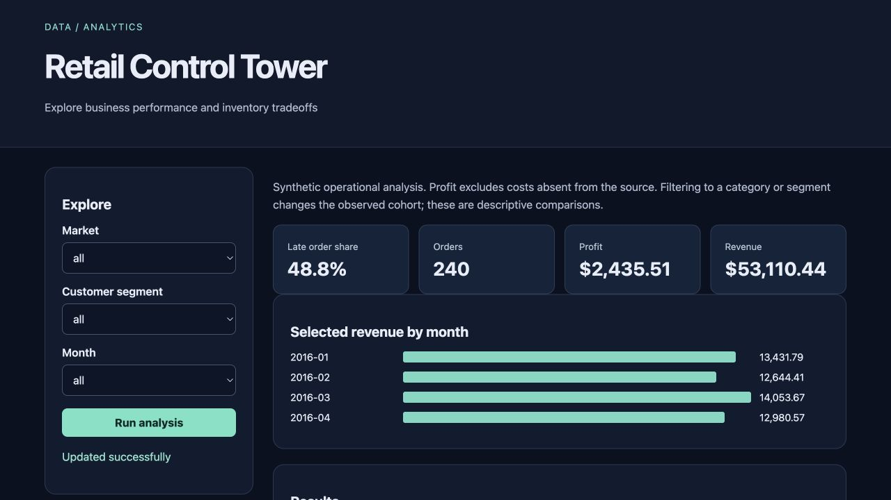

# Retail Control Tower

Explore business performance and inventory tradeoffs for **operations managers**.

Original topic: **Business Question Dashboard** from [the source post](https://www.instagram.com/p/DdyMaogE4ud/).

> Local portfolio implementation developed with Codex assistance. Measured results and limitations are documented; no production adoption, revenue or hiring outcome is claimed.



## What works

- Existing analytics
- independent browser dashboard
- filters
- drilldown

[Example output](reports/example-output.json) · [Verification notes](VERIFICATION.md) · [Learning and interview guide](LEARNING_GUIDE.md)

## Start

Python 3.12 is the validated Python runtime. Run commands from this repository directory. Windows users activate `.venv\Scripts\activate` instead of `source`.

```sh
python3.12 -m venv .venv
source .venv/bin/activate
python -m pip install -r requirements-dashboard.txt
python app.py
```

Open **http://127.0.0.1:8080**. Keep the process running. Set `PORT` to use another port (Retention Studio uses `--port`). The Python development servers are intended for local demonstrations.

The pre-existing forecasting/SQL pipeline and its original dependency file are preserved in this repository. See [pipeline documentation](README_PIPELINE.md). The browser dashboard above has a smaller, independent dependency file. Native Power BI and real-source Kaggle analysis are not claimed as completed.

## Demonstration

Install requirements-dashboard.txt, run app.py and filter by market/month. Reconcile category totals to KPI totals and inspect the late-order denominator. See README_PIPELINE.md for the preserved larger analysis pipeline.

## Architecture and decisions

Browser controls → validated Flask API → project analysis/workflow → results and export.

Stack: Python · SQLite · browser.

1. Extend the existing repository's fixture and analysis rather than counting it as a second project.
2. Use an explicit ingestion allowlist so privacy-test fields never enter dashboard calculations or exports.
3. Compute late-delivery rate at distinct-order grain while summing revenue/profit at line grain.

## Verification

```sh
python -m pytest -q tests/test_dashboard.py tests/test_api.py
```

See [VERIFICATION.md](VERIFICATION.md) for actual executed checks, setup verification, model/data results and any outstanding environment limitations. A workflow file alone is not evidence that CI passed.

## Data and attribution

Existing synthetic fixture; provenance preserved. See [DATA_AND_SOURCES.md](DATA_AND_SOURCES.md) for provenance and usage notes. Original project code is MIT unless a preserved source file or dependency states otherwise. Model and third-party data licenses remain separate.

## Limitations and next improvement

Synthetic DataCo-shaped fixture. The new browser dashboard is separate from the older forecasting pipeline and unverified native Power BI plans. Real Kaggle data and native PBIX remain optional unfinished extensions, not completed deliverables.

Suggested extension: Add a shipping-mode filter and test that order-level delivery metrics do not double count multi-line orders.

## Honest portfolio use

This implementation and documentation were developed with substantial Codex assistance. Before presenting it, run the demonstration, explain the design choices, and complete the suggested independent modification. Do not describe generated code as work experience, an accepted upstream contribution, or a deployed production service.
