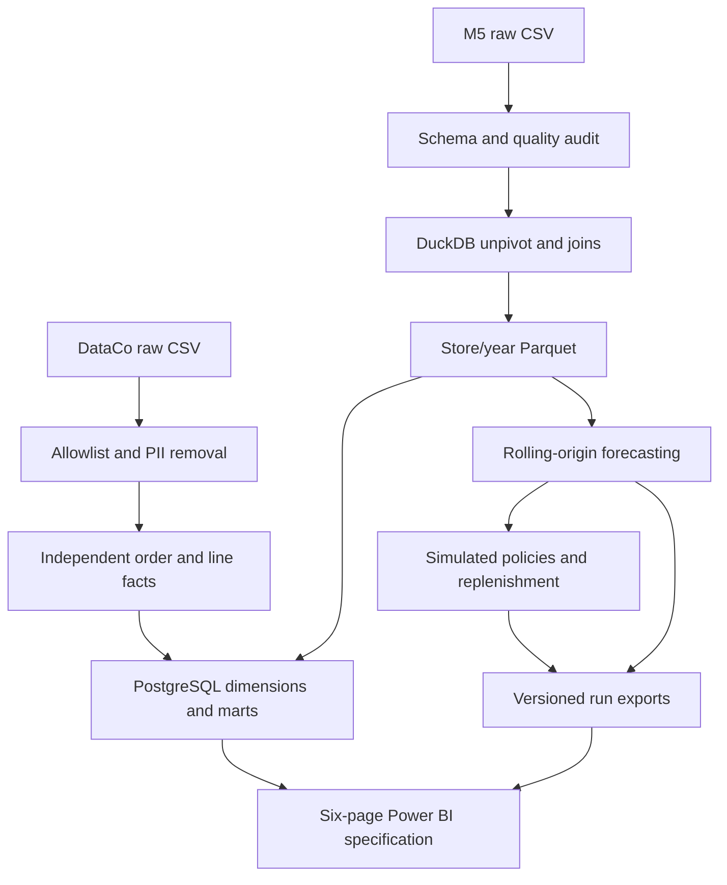
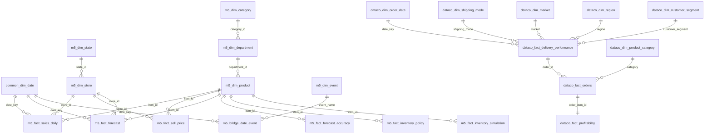

# Architecture and grains

The database uses shared calendar semantics but separate operational domains. Power BI uses independent role-playing date tables so historical source date ranges do not accidentally empty the other domain. Natural business keys are retained; no fictional cross-domain mapping is introduced. SQL table comments document grains; FKs and unique constraints enforce contracts.

The executable order is validation → Parquet → forecasting/simulation → transactional PostgreSQL load → BI. Transform and model jobs use Parquet for portability and reproducibility; the database is a serving layer and can be loaded after all outputs validate. This avoids a mandatory database dependency for the laptop demo. A PostgreSQL run uses one transaction to reload only owned tables, then builds marts and checks constraints. Point it at a dedicated project database; it replaces that database's project snapshots.

Full-mode notes: DuckDB can spill transformations to disk, global training is capped, and history is read in batches of 500 series. Full-mode forecast comparison results still require materialization; memory demand grows with series × horizon × models. Allocate sufficient RAM/disk and reduce inference batch size/training rows if needed. Simulations use an explicit pair cap and record coverage. The full M5 run has not been benchmarked on this machine.
